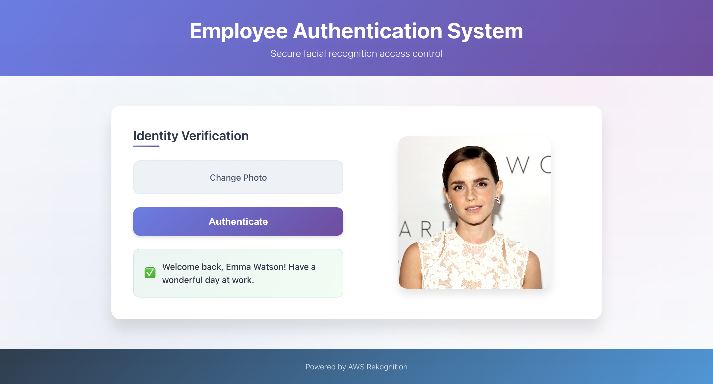
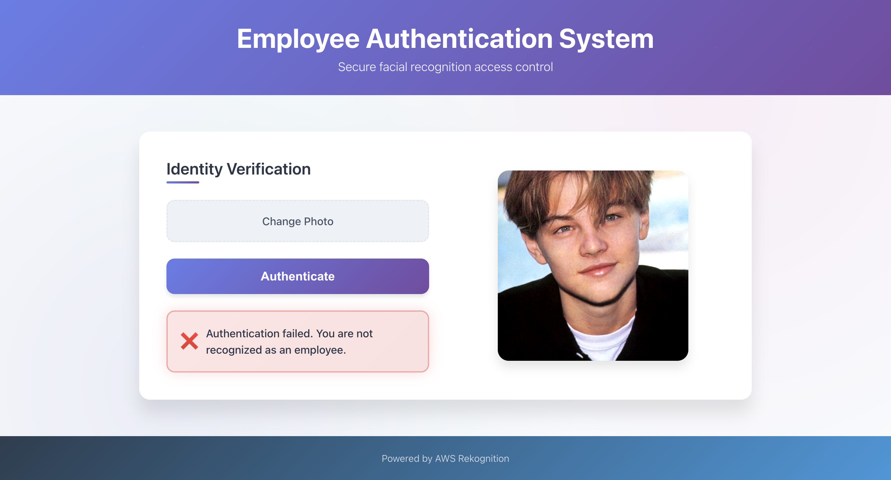

# Facial Recognition Attendance System

A serverless facial recognition system for employee attendance tracking using AWS services. Provides real-time face verification with 98%+ accuracy and sub-2-second processing.

## Features

- Real-time facial recognition using AWS Rekognition
- Modern responsive React frontend
- Serverless AWS architecture (Lambda, S3, DynamoDB, API Gateway)
- High accuracy verification across varied lighting conditions
- Secure IAM-based access control

## Screenshots

### Successful Authentication


### Failed Authentication


## Quick Start

### Prerequisites
- Node.js and npm
- AWS Account with configured services

### Setup
1. Clone the repository
2. Install frontend dependencies:
   ```bash
   cd frontend && npm install && npm start
   ```
3. Access at `http://localhost:3000`

## Architecture

- **Frontend**: React.js with modern UI  
- **Backend**: AWS Lambda functions (Python)  
- **Storage**: S3 (images), DynamoDB (employee data)  
- **AI**: AWS Rekognition for facial recognition  
- **API**: AWS API Gateway with RESTful endpoints  

## Project Structure

```
facial-recognition-app/
├── frontend/                 # React application
│   ├── src/
│   │   ├── App.js           # Main component
│   │   ├── config.js        # API configuration
│   │   └── visitors/        # Sample images
│   └── package.json
├── lambda/                  # AWS Lambda functions
│   ├── employee_authentication.py
│   └── employee_registration.py
├── screenshots/             # Application screenshots
└── README.md
```

## Technology Stack

- **Frontend**: React, CSS3, HTML5  
- **Backend**: Python, AWS Lambda  
- **Cloud**: AWS (API Gateway, S3, Rekognition, DynamoDB)  
- **Authentication**: AWS IAM  

## AWS Configuration

**Required AWS Resources:**
- S3 Bucket: `face-recognition-visitor-image`
- Rekognition Collection: `employees`
- DynamoDB Table: Employee records
- Lambda Functions: Authentication & registration
- API Gateway: REST endpoints
- IAM Roles: Service permissions

**Region**: us-west-1  
**API Endpoint**: `9un5km3hz5.execute-api.us-west-1.amazonaws.com`

## API Endpoints

- `GET /employee?objectKey={filename}` - Authenticate employee
- `PUT /face-recognition-visitor-image/{filename}` - Upload photo

---

<div align="center">
  <strong>⭐ Star this repository if you find it helpful!</strong>
</div> 
